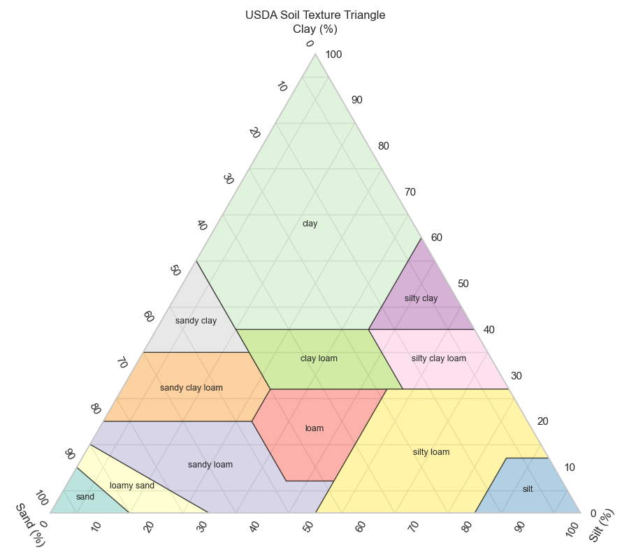

# Directory 
```
.
├── config - configuration files for the libraries.
├── data - example data files only used by CLI application. 
├── exclusion_rules - documentation for the exclusion rules library.
├── notebooks/imputation_model_training.ipynb - trains and evaluates the ML imputation pipeline.
├── notebooks/growth_model_training.ipynb - trains and evaluates the tree growth rate model.
├── src
│   ├── app - CLI application for recommendation system. Does not use database.
│   ├── exclusion_rules - exclusion rules library code.
│   ├── imputation - ML imputation service (imputation_service.py, __init__.py).
│   ├── models/imputation/ - trained model artefacts (*.joblib).
│   ├── models/growth/ - trained growth model artefacts (*.joblib, *.json).
│   ├── scripts/growth_cleaning.py - TreeO2 data cleaning and growth rate computation.
│   ├── scripts - miscellaneous scripts.
│   └── suitability_scoring - suitability scoring library code.
├── suitability_scoring - documentation and Jupyter notebooks for the suitability scoring library.
└── tests - pytest files for all libraries.
    ├── test_imputation_service.py - unit tests (mocked model).
    └── test_imputation_integration.py - integration tests (real model).
```

# Getting started

Install `uv` for your chosen OS from:
```
https://docs.astral.sh/uv/getting-started/installation/
```
and confirm it is installed with `uv --version`.
You should see something like 
```console
C:\...\Planting-Optimisation-Tool > uv --version
> uv 0.8.14
```
Then 
```bash
cd ..
cd datascience
```
Run `uv sync` to install all requirements from `pyproject.toml` for the datascience directory.

If there are additional python packages you require, run `uv add packagename` to add it to the project.

This project uses Ruff linter and formatter (https://docs.astral.sh/ruff/tutorial/) to enforce PEP 8 style guide for python (https://peps.python.org/pep-0008/)

To run, from the base directory of your team, enter `uv run ruff check` and it will test your code for issues. 

You can also choose to run `uv run ruff check --fix` to automatically fix any linting issues.


# Models

## Imputation Model

Fills missing environmental variables in a farm profile using a trained scikit-learn pipeline (`IterativeImputer` + `RandomForestRegressor`). Base features (`latitude`, `longitude`, `area_ha`, `coastal`, `riparian`) must always be present; target features (`elevation_m`, `slope`, `temperature_celsius`, `rainfall_mm`, `ph`) may be `None` and will be imputed.

**Training data:** `backend/src/scripts/data/farm_master.csv` — 3,200 farm records.

**Evaluation — 5-fold CV, 30% MCAR masking**

| Feature | RMSE (mean ± std) | Threshold | Status |
|---|---|---|---|
| `elevation_m` | 123.556 ± 8.562 m | 100 m | FAIL |
| `slope` | 4.642 ± 0.245 ° | 5 ° | PASS |
| `temperature_celsius` | 0.685 ± 0.088 °C | 2 °C | PASS |
| `rainfall_mm` | 47.938 ± 15.384 mm | 200 mm | PASS |
| `ph` | 0.434 ± 0.039 | 1.0 | PASS |

`elevation_m` exceeds its threshold — elevation changes sharply over short distances and is hard to recover from lat/lon alone. The model still outperforms a naive mean imputer and is used as a graceful fallback when the value is unavailable.

**Service:** `src/imputation/imputation_service.py` — lazy-loads on first call, exposes `impute_missing(profile)`.

**To retrain:** run `notebooks/imputation_model_training.ipynb`. Artefacts saved to `src/models/imputation/`.

---

## Growth Model

Predicts annualised trunk circumference growth rate (cm/year) per tree from historical TreeO2 measurement data.

**Architecture:** `RandomForestRegressor` (selected via 5-fold CV against LinearRegression, Ridge, GradientBoosting). Best params: `n_estimators=200`, `max_depth=20`, `min_samples_leaf=5`.

**Data pipeline:** 983,523 raw measurements → `growth_cleaning.py` (outlier removal, spike-revert interpolation) → one row per tree using first/last valid scan → **230,351 trees** in the ML dataset.

**Features:** `first_age`, `mid_age`, `first_circ`, `age_span`, `species_<name>` (one-hot, 9 species).

**Target:** `net_growth_rate_cm_yr` — annualised circumference growth (cm/year).

**Final evaluation — held-out test set (20%, n = 46,071)**

| RMSE | MAE | R² |
|---|---|---|
| 2.030 cm/yr | 1.617 cm/yr | 0.312 |

R² = 0.31 reflects that growth rate is inherently noisy — soil quality, management, and micro-climate are unmeasured. The model is suited for ranking species by expected growth trajectory rather than precise per-tree prediction.

**Artefacts saved to `src/models/growth/`:** `growth_pipeline.joblib`, `growth_feature_columns.joblib`, `growth_model_summary.json`.

**To retrain:** run `notebooks/growth_model_training.ipynb`. Requires `data/treeo2_dec5_cleaned.csv.gz` and `backend/src/scripts/data/species_20251222.csv`.


# Configuration
The global configuration for the suitability scoring is contained (`config/recommend.yaml`). The soil texture compatibility map in that file has been generated with the script `src/scripts/generate_soil_texture_compatibility_yaml`. The compatibility scores are set by adjacency on the texture triangle:

* exact = 1.0
* 1-step neighbours (e.g., loam ↔ sandy_loam) ≈ 0.8
* 2-step ≈ 0.6
* 3-step=0.4
* \>=4-step=0.3
* hard incompatibilities as 0.0.



The rationale of this approach is that scores are monotonic with textural proximity, aligning with agronomic intuition (coarser textures differ in water holding and nutrient retention vs finer textures).

Species-specific overrides (`species_params`) are built into the database and in the current version cannot be changed once the database is initialised. Before database ingestion the parameters can be edited in the `..\src\scripts\data\species_params20260112.csv` file.


For a full description of how to configure the suitability scoring library documentation (`docs/scoring_design.md`).

# Usage as a library
```{python}
# Load configuration and data
from yourlib import (
     load_yaml,
     build_species_params_dict,
     build_rules_dict,
     calculate_suitability,
     build_species_recommendations,
 )

# Load configuration file
cfg = load_yaml("config.yaml")

# Build parameters index and scoring rules
params = build_species_params_dict(species_params_rows, cfg)
rules = build_rules_dict(species_list, params, cfg)

# Score all species for the farm and get explanations
# farm single farm profile dict
results, scores = calculate_suitability(farm, species_list, rules, cfg)

# Produce ranked recommendations
recs = build_species_recommendations(results)
recs[:3]
[{'species_id': 101, 'species_name': 'X', 'species_common_name': 'Y',
  'score_mcda': 0.842, 'rank_overall': 1,
  'key_reasons': ['Soil:exact match', 'Rainfall:inside preferred range', ...]},
 ...]
```
